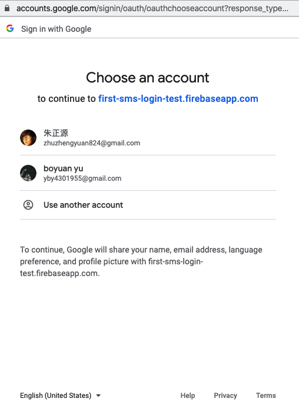
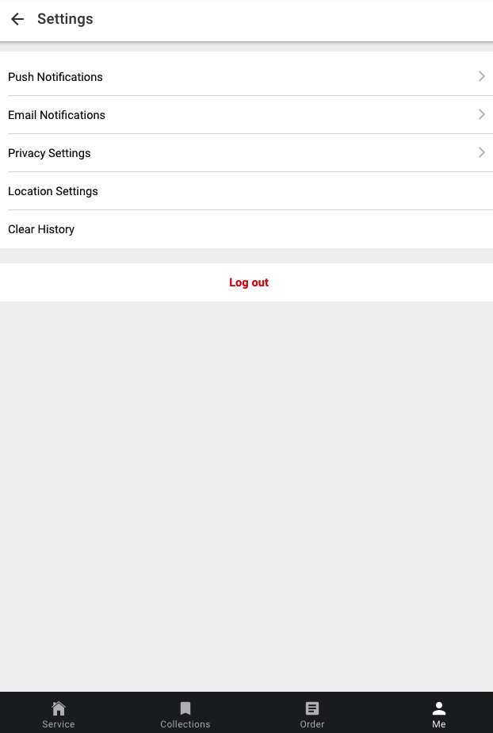
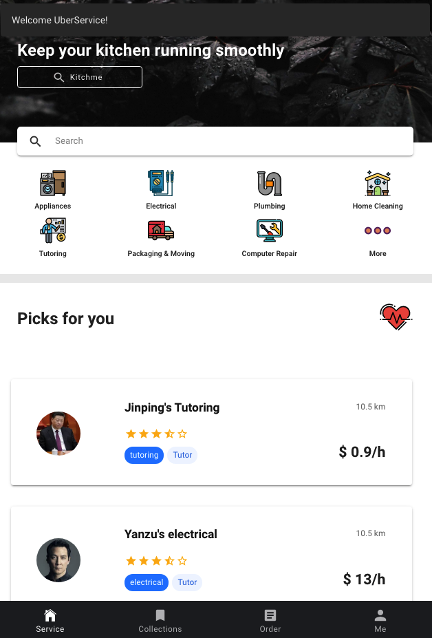
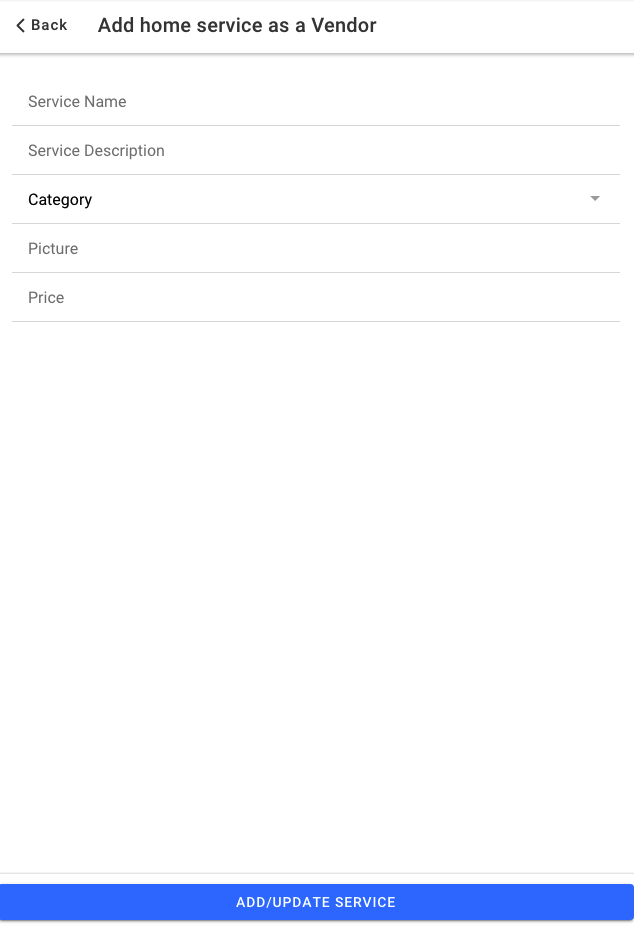
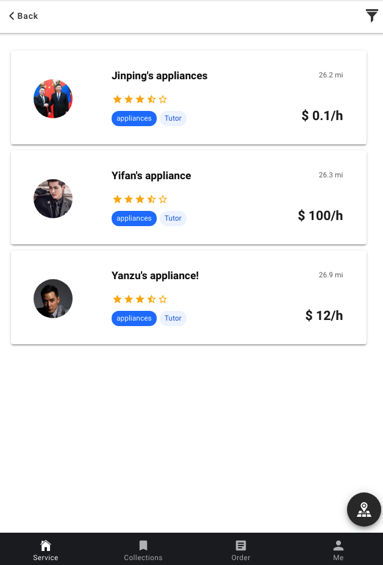
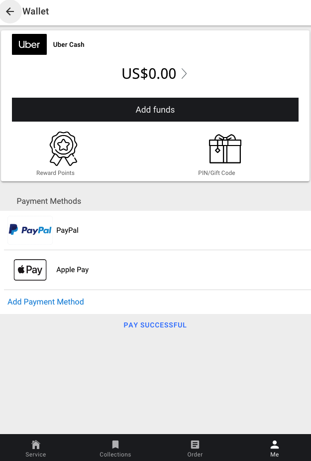
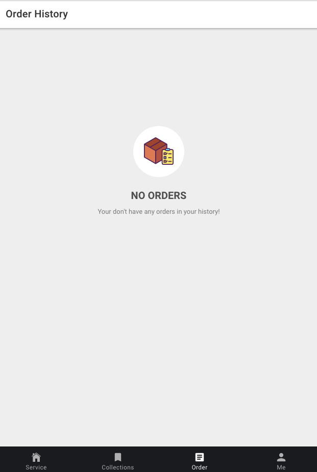
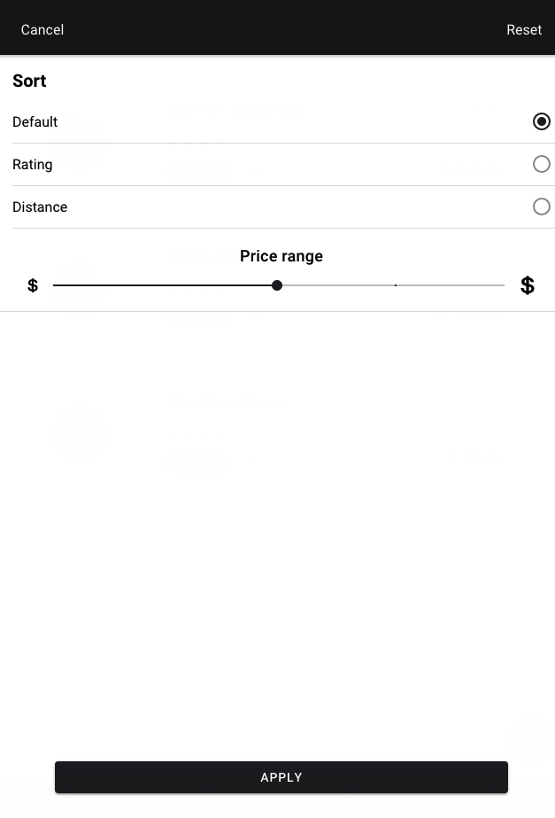

# Uber ServeMe System
<!-- markdownlint-disable MD033 -->
<p align="left">
    
    
</p>


[ServeMe System](https://github.com/824zzy/CSE-6324_ADV_SOFTWARE_ENGINEERING) helps users **initiate “service request” for their home or small business**. This will help users (i.e. customers that require service) to be put in contact with service providers. You will make money by collecting commission from each service request fulfilled by the service provider. The categories of services (displayed graphically by an icon) can be expanded to cover more service areas in the future.

## Install

``` sh

$ git clone https://github.com/824zzy/CSE-6324_ADV_SOFTWARE_ENGINEERING
$ cd SMS
$ npm i
$ Change firebase & google service configuration.
$ ionic run cordova browser

```

## Components

- [x] Login & Registration





- [x] Setep Settings



- [x] Service Categories: Appliances, Electrical, Plumbing, Home Cleaning, Tutoring, Packaging and Moving, Computer Repair, Home Repair and Painting, Pest Control.



- [x] Register to become an approved vendor



- [x] Place a Service Request (by Customers): Select a Service category and place an order soliciting for bid by the service providers. Finalize your selection after reviewing all bids.



- [x] Cancellation and Change: Allow customers to cancel or change service dates. You can specify in setup that you lose points if you cancel within the last x (e.g. 24) hours
- [x] Accept a Service Request (by service provider)): Provide bids for Requested services to customers.
- [x] Payments: Handle money paid by the customers, received by the service provider. You, the owner of app, will receive a commission (e.g. 20%) of the service fee.



- [x] Review and Rating (by customers): Use Stars (one to five stars) to rate the service received, and allow to enter for a short comment to help future users


- [x] Order History: Display the history of service requested for a given customer.



- [x] Search: Ability to search by for a service provider by address, name, star rating, etc.



## Resources

- [Ionic/Angular](https://ionicons.com/)
- [Firebase](https://firebase.google.com/)
- [FirebaseUI](https://github.com/firebase/firebaseui-web)
- [Google Map](https://developers.google.com/maps/gmp-get-started)

## Contributor

1. [Zhengyuan Zhu](zzy824.cn)
2. [Boyuan Yu](https://github.com/peteryu929)
